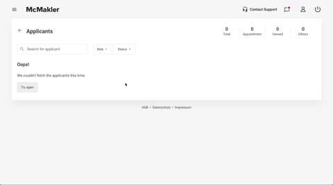

# Applicants Page

Applicants page is a single page react application where you can see all the applicants that applied to your property. It has a basic search functionality and API response is mocked on the frontend. There is a high possibility of getting an API error to demonstrate an error state.

### Features:
1. Shareable search URL
2. Error and loading states
3. Random applicant avatars
4. Snapshot tests
5. Mobile-first design approach
6. Easy to customize the theme by CSS variables
7. CSS-in-JS approach
8. Localization ready
9. CD pipeline using Vercell

## See in action

https://applicants-page-react.vercel.app/

## Technologies

- React (Hooks)
- React Router
- React Query
- React i18
- Styled Components
- Lodash
- date-fns
- jest & react-test-renderer
